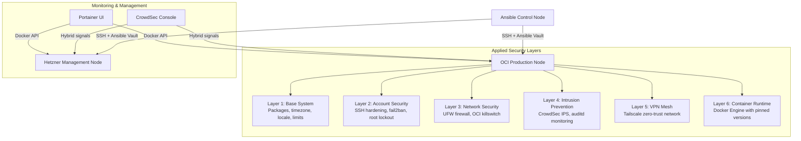

# Architecture Overview

## 🏗️ System Architecture

The NIST Hardening Suite is a multi‑layer security framework that transforms vanilla Linux servers into NIST 800‑53 compliant bastion hosts.

### Core Design Principles

1. **Idempotence** – Safe to run repeatedly, produces identical results
2. **Provider‑Agnostic** – Works across cloud providers (Oracle Cloud, Hetzner, AWS, GCP, etc.)
3. **Defense in Depth** – Multiple overlapping security controls
4. **Zero Trust Networking** – Tailscale VPN replaces public SSH access
5. **Secrets‑First** – All credentials encrypted with Ansible Vault

## 📦 Component Architecture



## 🔐 Security Architecture

### NIST 800‑53 Control Implementation

| Control | Layer | Implementation |
|---------|-------|----------------|
| **AC‑2** Account Management | Layer 2 | SSH password auth disabled, root login prohibited, fail2ban brute‑force protection |
| **CM‑7** Least Functionality | Layer 1 | Unused filesystems (cramfs, freevxfs, etc.) blacklisted, minimal packages |
| **SC‑7** Boundary Protection | Layer 3 | UFW default‑deny firewall, provider‑specific iptables hardening, rate‑limited SSH |
| **SI‑4** System Monitoring | Layer 4 | CrowdSec collaborative IPS, real‑time threat detection, log analysis |
| **AU‑12** Audit Generation | Layer 4 | auditd system‑call monitoring, privileged command logging, tamper‑resistant logs |
| **SC‑28** Data at Rest | All Layers | Secrets via Ansible Vault; disk encryption handled at provisioning (audit only) |

### Network Architecture

```
Public Internet
    │
    ├── Brain Node (Hetzner)
    │   ├── SSH (rate‑limited, public)
    │   ├── HTTP/HTTPS (public)
    │   └── Tailscale VPN (100.64.0.0/10)
    │
    └── Muscle Nodes (Oracle Cloud)
        ├── SSH (Tailscale VPN only)
        ├── HTTP/HTTPS (public)
        └── Tailscale VPN (100.64.0.0/10)
```

**Key Decisions:**
- **Public SSH only on Brain** – Management node accessible for emergencies
- **Muscle nodes VPN‑only** – Compute workers isolated from public internet
- **Tailscale mesh** – Zero‑trust networking with mutual TLS authentication
- **UFW over iptables** – Simpler management, less error‑prone

## 🔄 Execution Flow

### Bootstrap Phase (`site.yml`)
```
1. Pre‑flight validation (secrets, inventory)
2. Base system configuration (common role)
3. Security hardening (security role)
4. Intrusion prevention (crowdsec role)
5. VPN mesh establishment (tailscale_client role)
6. Docker engine installation (docker role)
7. Verification and status reporting
```

### Application Phase (`stacks.yml`)
```
1. Ingress layer deployment (Caddy reverse proxy)
2. Management layer deployment (Portainer UI + Edge Agents)
3. Observability configuration (VictoriaMetrics, Grafana, Loki)
```

## 🗂️ Directory Structure

```
nist-hardening-suite/
├── roles/                    # Ansible roles
│   ├── common/              # Base system configuration
│   ├── security/            # SSH, firewall, fail2ban hardening
│   ├── crowdsec/            # Intrusion prevention system
│   ├── tailscale_client/    # VPN mesh network
│   ├── docker/              # Docker Engine installation
│   ├── stack_ingress/       # Caddy reverse proxy
│   ├── stack_portainer/     # Docker management UI
│   └── observability/       # Monitoring stack configs
├── group_vars/              # Group variables
│   ├── all/                 # Global variables & secrets
│   ├── brain/               # Management node configs
│   └── muscle/              # Compute node configs
├── inventory/               # Server inventory
├── scripts/                 # Utility scripts
├── site.yml                 # Main hardening playbook
├── stacks.yml               # Application deployment playbook
├── nuke.yml                 # Complete cleanup playbook
└── ARCHITECTURE.md          # This document
```

## 🔧 Technical Decisions

### Why Ansible?
- **Agentless** – No software required on target servers
- **Idempotent** – Safe for continuous compliance
- **Human‑readable** – YAML syntax accessible to ops teams
- **Extensible** – Large collection ecosystem

### Why Tailscale over WireGuard?
- **Zero‑config** – No manual peer management
- **Centralized ACLs** – Policy‑based access control
- **NAT traversal** – Works behind firewalls without port forwarding
- **Commercial support** – Enterprise‑grade reliability

### Why CrowdSec over traditional IDS?
- **Collaborative** – Learns from global threat intelligence
- **Low false positives** – Behavior‑based detection
- **Container‑native** – Lightweight, Docker‑friendly
- **Open core** – Free local detection, paid console optional

### Why UFW over nftables/iptables?
- **Simpler syntax** – Less error‑prone for basic rules
- **Ubuntu default** – Well‑tested, widely supported
- **Docker integration** – Automatic rule management for containers
- **Adequate for most use cases** – Complex rules can use raw iptables

## 📈 Scaling Considerations

### Horizontal Scaling
- Add more `muscle` nodes to inventory
- Portainer Edge Agents automatically connect to management node (pull‑based)
- CrowdSec signals shared across all nodes
- Tailscale mesh automatically includes new nodes

### Vertical Scaling
- Increase Docker resource limits in `daemon.json`
- Adjust UFW connection limits for high‑traffic services
- Scale CrowdSec parser routines based on log volume
- Tune auditd rules for specific compliance requirements

### High Availability
- Brain node is single point of failure for management
- Muscle nodes are stateless, can be replaced automatically
- Consider deploying multiple brain nodes with load balancing
- Regular backups of Portainer configurations and Docker volumes

## 🚀 Deployment Considerations

### Cloud Provider Specifics
- **Oracle Cloud (OCI)** – Requires iptables killswitch (provider‑injected rules)
- **Hetzner** – Clean slate, minimal provider interference
- **AWS/GCP/Azure** – Tested but may need provider‑specific firewall rules
- **Bare Metal** – Works identically, no cloud‑specific modifications

### Performance Impact
- **CPU**: <5% for security tools (CrowdSec, auditd)
- **Memory**: ~200MB for Docker, ~100MB for Tailscale, ~50MB for CrowdSec
- **Network**: Minimal overhead for Tailscale (WireGuard‑based)
- **Disk**: ~2GB for Docker images, logs rotate automatically

## 🔍 Monitoring & Observability

### Built‑In Monitoring
- **CrowdSec alerts** – Real‑time security incidents
- **auditd logs** – System‑call auditing (NIST AU‑12)
- **Docker metrics** – Container resource usage
- **Tailscale status** – VPN connectivity and latency

### Optional Observability Stack
- **VictoriaMetrics** – Time‑series database for metrics
- **Grafana** – Dashboards and visualization
- **Loki** – Log aggregation and querying
- **Uptime Kuma** – Service availability monitoring

## 🔒 Security Considerations & Known Risks

### Portainer Edge Agent Architecture
The suite deploys **Portainer Edge Agent** by default (`portainer-edge-agent.yml.j2`), which uses a **pull‑based architecture** with **zero open ports** on managed nodes. This eliminates lateral movement risks identified in previous audits:

- **Zero open ports**: Edge Agents poll the Portainer server every 5 seconds via outbound connections
- **Reduced attack surface**: No API endpoints exposed on the Tailscale network
- **True Zero Trust**: Agents initiate connections; they don't listen for incoming requests
- **Docker socket**: Mounted read‑only (`:ro`) to prevent container creation/removal

### Caddy Ingress & Zero Trust
The default `Caddyfile.j2` includes a `(vpn_only)` block that restricts access to Tailscale IPs (100.64.0.0/10). All example site definitions import this block, enforcing Zero Trust at the ingress layer. Remove `import vpn_only` from any site that requires public internet access.

### SC‑28 Data at Rest Clarification
The NIST SC‑28 control is partially implemented:
- **Secrets encryption**: Fully automated via Ansible Vault (secrets encrypted at rest)
- **Disk encryption**: **Not automated** – the suite only audits for existing LUKS encryption (`lsblk -f | grep crypto_LUKS`). Full disk encryption must be configured manually at the provider or OS level.

### Tailscale Authentication Key Handling
Authentication keys are passed via `stdin` to `tailscale up --authkey=-` and never written to disk, eliminating the race‑condition risk of temporary file residue.

## 📚 References

- [NIST 800‑53 Security Controls](https://nvlpubs.nist.gov/nistpubs/SpecialPublications/NIST.SP.800-53r5.pdf)
- [CIS Benchmarks](https://www.cisecurity.org/cis-benchmarks)
- [Ansible Best Practices](https://docs.ansible.com/ansible/latest/user_guide/playbooks_best_practices.html)
- [Tailscale Documentation](https://tailscale.com/kb/)
- [CrowdSec Documentation](https://docs.crowdsec.net/)