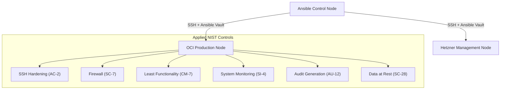

# NIST Hardening Suite | Developmi


> 🛡️ **NIST‑ALIGNED HARDENING SUITE**
> 
> **The Script is Free. Peace of Mind Isn't.**
> 
> This open-source Ansible suite demonstrates enterprise‑grade security hardening aligned with NIST 800‑53.
> It implements NIST 800‑53 controls for hybrid cloud infrastructure:
> - SSH hardening & root account lockout (AC‑2)
> - Firewall enforcement with UFW (SC‑7) 
> - Intrusion prevention with CrowdSec (SI‑4)
> - Encrypted secrets management with Ansible Vault
> 
> **Business Model:** The hardening script is free (MIT licensed). I charge a monthly retainer for continuous monitoring via CrowdSec, ensuring your infrastructure stays compliant.

> **Current Release:** `v4.1.1` (Security audit workflow tightening, detect-secrets baseline repair, overlay-only transport enforcement, Uptime Kuma decoupled from observability, Caddyfile integration modes, and documentation alignment)

---

## 📖 Overview

The **NIST-Compliant Hardening Suite** is an automated configuration management framework designed to solve the **Security Parity** problem in hybrid cloud environments.

### 🎯 Initially Focused On:
- **🏢 Hetzner** – Bare Metal servers (Cloud specials, dedicated hosting)
- **☁️ Oracle Cloud** – OCI Compute instances (E2, Standard, Optimized shapes)

It guarantees that nodes running in **Oracle Cloud** and **Hetzner** maintain an identical defensive posture—independent of hardware architecture, hypervisor, or provider defaults.

> **Note:** While built for OCI + Hetzner, the playbooks are cloud-agnostic and should work on any Debian/Ubuntu-based system.

---

## 🚀 Quick Start

### Prerequisites
- Python 3.14+
- `uv` for reproducible local tooling
- Ansible Core 2.19+
- `ansible-vault` for secret management  
- SSH access to target servers

### 1. Clone & Setup
```bash
git clone https://github.com/Miguel-DevOps/nist-hardening-suite.git
cd nist-hardening-suite

# Sync toolchain (recommended)
uv sync

# Install Ansible collections
uv run ansible-galaxy collection install -r requirements.yml
```

### 2. Configure Inventory
Edit `inventory/hosts.ini` with your server IPs and credentials:
```ini
[brain]
brain-1 ansible_host=YOUR_PUBLIC_IP ansible_user=root public_ip=YOUR_PUBLIC_IP

[muscle]  
muscle-1 ansible_host=YOUR_PUBLIC_IP ansible_user=ubuntu public_ip=YOUR_PUBLIC_IP
```

### 3. Set Up Encrypted Secrets
```bash
# Copy and encrypt secrets (GitHub token + Tailscale node auth key required)
cp group_vars/all/secrets.yml.example group_vars/all/secrets.yml
ansible-vault encrypt group_vars/all/secrets.yml

# Edit encrypted file
ansible-vault edit group_vars/all/secrets.yml
```

For Portainer Edge-only deployments, add one entry per Edge environment (node) to `portainer_edge_keys_by_node` in your Vault. Keys use the exact inventory hostname. Recommended naming from day one: `brain-1`, `muscle-1`, `brain-2`, `muscle-2`, etc.

```yaml
portainer_edge_keys_by_node:
  brain-1: "EDGE_KEY_FOR_BRAIN_1"
  muscle-1: "EDGE_KEY_FOR_MUSCLE_1"
  # brain-2: "EDGE_KEY_FOR_BRAIN_2"
  # muscle-2: "EDGE_KEY_FOR_MUSCLE_2"
```

Default routing:
- Brain hosts associate their Edge Agent to themselves.
- Muscle hosts associate to `groups['brain'][0]` unless `portainer_edge_target_brain` is overridden per host or group.

For automated ACL management, also set `tailscale_acl_client_id` and a `tailscale_acl_key` that starts with `tskey-client-`.
Legacy long-lived API tokens are not supported by the current ACL automation flow.

### 4. Run Base Hardening (NIST Compliance)
```bash
# Full NIST hardening (takes ~10-15 minutes)
uv run ansible-playbook -i inventory/hosts.ini site.yml --ask-vault-pass

# Expected output includes:
# ✅ SSH password auth DISABLED (keys only)
# ✅ Fail2ban active (3 attempts = 1h ban)  
# ✅ UFW enabled with Docker ports configured
# ✅ Tailscale VPN mesh established
# ✅ NIST controls AC‑2, CM‑7, SC‑7, SI‑4, AU‑12, SC‑28 (secrets via Vault; disk encryption at provisioning) applied
```

### 5. Deploy Management Stack
```bash
# Create your local ingress template first (intentionally ignored by git)
cp roles/stack_ingress/templates/Caddyfile.example.j2 roles/stack_ingress/templates/Caddyfile.j2

# After hardening, deploy Portainer Edge Agent + Caddy
uv run ansible-playbook -i inventory/hosts.ini stacks.yml --ask-vault-pass
```

### 5.1 Optional Add-on: Observability Stack (Anti-Bloat)
Use this only on servers with sufficient resources.
```bash
# Deploy VictoriaMetrics + Grafana + Loki (optional)
uv run ansible-playbook -i inventory/hosts.ini monitoring.yml --ask-vault-pass
```

Observability variable model:
- `enable_observability_stack`: node hosts Grafana/VictoriaMetrics/Loki preparation
- `enable_metrics_exporters`: node is expected to expose metrics toward brain
- `observability_network_name`: Docker bridge network name used by Node Exporter/cAdvisor (Vault-backed in `group_vars/all/secrets.yml`)
- `observability_cadvisor_port`: host port published for cAdvisor metrics (default `18080` to avoid common `8080` collisions)
- `observability_stack_host_ip`: bind address used by observability stack env rendering (Vault-backed in `group_vars/all/secrets.yml`)
- `observability_stack_network_name`: Docker network used by the observability stack
- `observability_stack_network_external`: whether stack network is external (`true`) or managed bridge (`false`)
- Recommended architecture: `brain=true/true`, `muscle=false/true`

Observability compose source of truth is centralized in role templates:
- `roles/observability/templates/exporters-docker-compose.yml.j2` (single template for brain + muscle)
- `roles/observability/templates/observability-stack-docker-compose.yml.j2` (brain stack)

After running `monitoring.yml`, Ansible prepares these generated artifacts on target hosts:
- `/srv/app/observability/exporters/docker-compose.yml` (on nodes with `enable_metrics_exporters: true`)
- `/srv/app/observability/docker-compose.yml` (on brain when `enable_observability_stack: true`)
- `/srv/app/observability/.env` (rendered from Vault-backed variables with mode `0600`)
- `/srv/app/observability/.env.example` (reference template)

Deployment of observability containers is automated by Ansible via `community.docker.docker_compose_v2`.
Sensitive runtime values are stored in `group_vars/all/secrets.yml` and rendered on-host into `/srv/app/observability/.env` with restrictive permissions.

Selective deployment for observability is available through `monitoring.yml` tags:
- `exporters`: deploy Node Exporter + cAdvisor on nodes with `enable_metrics_exporters: true`
- `observability_stack` or `stack`: deploy VictoriaMetrics + Loki + Grafana on brain nodes
- `node_exporter`, `cadvisor`, `victoriametrics`, `loki`, `grafana`: deploy only that service while still preparing required shared assets

> **Note:** For NIST/CIS-aligned segmentation, Node Exporter and cAdvisor are configured in bridge mode with read-only host mounts (`/proc`, `/sys`, `/`). Advanced host metrics that require host mode will be evaluated in future releases with dedicated segmentation and compensating controls.

> **cAdvisor security profile:** cAdvisor runs in a least-privilege profile compatible with hardened Docker hosts: no `privileged`, no host namespace sharing, `no-new-privileges`, read-only filesystem, and reduced metric collection. On Docker hosts using `userns-remap`, this preserves isolation but can reduce container-level visibility compared with a fully privileged deployment.

Post-deploy validation (recommended after each `monitoring.yml` run):

```bash
# 1) Validate exporters are up on all expected nodes
uv run ansible all -i inventory/hosts.ini -m shell -a "docker ps --format '{{.Names}} {{.Status}}' | grep -E 'node-exporter|cadvisor'"

# 2) Validate metrics endpoints locally on each node
uv run ansible all -i inventory/hosts.ini -m shell -a "curl -fsS http://127.0.0.1:9100/metrics >/dev/null && echo node_exporter_ok"
uv run ansible all -i inventory/hosts.ini -m shell -a "curl -fsS http://127.0.0.1:18080/metrics >/dev/null && echo cadvisor_ok || echo cadvisor_limited_or_down"

# 3) Validate scrape targets from brain (VictoriaMetrics)
uv run ansible brain -i inventory/hosts.ini -m shell -a "curl -fsS 'http://127.0.0.1:8428/api/v1/targets' | grep -E 'node-exporter|cadvisor'"
```

Expected result:
- `node_exporter_ok` should be present on exporter-enabled nodes.
- `cadvisor_ok` is ideal; `cadvisor_limited_or_down` can occur on hardened nodes and should be evaluated against your accepted observability baseline.
- Brain target view should list Node Exporter consistently; cAdvisor may be partial depending on hardening constraints.

Selective cleanup for observability is available through `nuke.yml` tags:
- `exporters`: removes Node Exporter + cAdvisor and shared exporters assets
- `observability_stack`: removes VictoriaMetrics + Loki + Grafana and shared stack assets
- `node_exporter`, `cadvisor`, `victoriametrics`, `loki`, `grafana`, `uptime_kuma`: removes only that service and its dedicated data when applicable (`uptime_kuma` tag is kept for legacy cleanup compatibility)
- `observability_networks`: attempts to remove observability networks to prevent stale-name reuse on future redeployments

Warning: service-specific cleanup can leave shared observability assets in place by design, while broader tags such as `observability_stack`, `exporters`, `observability`, or `monitoring` can break remaining observability components if used partially.

### 5.2 Recommended Applications (Optional, Plug-and-Play)
Recommended apps that are not part of the core observability role now live under `recommended_apps/`.

Current catalog:
- `recommended_apps/uptime-kuma/docker-compose.yml`
- `recommended_apps/uptime-kuma/.env.example`

Deployment model:
- Core platform keeps Caddy as the standard ingress boundary and Zero Trust choke point.
- App compose files are optional artifacts designed for Portainer UI or Docker Compose.
- For secure defaults, prefer exposing apps through Caddy on `public_net` instead of opening direct host ports.

See `APP_RECOMMENDED_GUIDE.md` for secure deployment patterns and operational guidance.

### 6. Verify & Monitor
```bash
# Check security status
uv run ansible all -i inventory/hosts.ini -m command -a "tailscale status"

# View CrowdSec alerts (intrusion detection)
uv run ansible all -i inventory/hosts.ini -m shell -a "cscli alerts list"

# Monitor audit logs (NIST AU‑12)
uv run ansible all -i inventory/hosts.ini -m shell -a "tail -f /var/log/audit/audit.log"
```

### 📋 What Gets Installed
| Component | Purpose | NIST Control |
|-----------|---------|--------------|
| **UFW Firewall** | Default‑deny firewall with SSH rate limiting | SC‑7 |
| **Fail2ban** | Brute‑force protection (3 attempts = 1h ban) | AC‑2 |
| **Tailscale VPN** | Zero‑trust mesh network (replaces public SSH) | SC‑7 |
| **CrowdSec** | Collaborative intrusion prevention system | SI‑4 |
| **AuditD** | System call monitoring & audit trail | AU‑12 |
| **Docker Engine** | Container runtime (pinned versions) | CM‑7 |
| **Portainer Edge Agent** | Pull‑based container management (zero open ports) | SC‑7 |
| **Ansible Vault** | Encrypted secrets management | SC‑28 (Audit Only / Partial) |
 
**Note on SC‑28 (Data at Rest):** Implemented via Ansible Vault for secrets. Disk encryption must be handled at the provisioning layer (Tofu/Terraform). This suite does NOT encrypt disks and only audits for existing LUKS.

---
## ⚠️ Security Considerations

### 🛡️ Portainer Edge Agent (Only Mode)
The suite deploys **Portainer Edge Agent** only, which uses a **pull‑based architecture** with **zero open ports** on managed nodes. This eliminates lateral movement risks:

- **Zero open ports**: Edge Agents poll the Portainer server every 5 seconds via outbound connections
- **Reduced attack surface**: No API endpoints exposed on the Tailscale network  
- **True Zero Trust**: Agents initiate connections; they don't listen for incoming requests
- **Docker socket**: Mounted in the agent container (required for Docker management operations). Treat as privileged access and isolate via Tailscale + host hardening.

### 🔐 Tailscale ACLs (Zero Trust Networking)
**Required for production deployments**:
- ACLs enforce least‑privilege access between `brain` and `muscle` nodes
- Port‑level restrictions (e.g., SSH port 22)
- Tag‑based policies for simplified management
- Automated ACL configuration is OAuth-only via `tailscale_acl_client_id` + `tailscale_acl_key` (no API token mode)
- ACL policy is validated before apply via Tailscale API to prevent unsafe policy pushes
- Existing ACL automation that used legacy API bearer tokens must migrate credentials before upgrading

### ☢️ Nuclear Cleanup (`nuke.yml`)
This playbook is destructive and irreversible. It includes a mandatory confirmation prompt requiring the exact phrase `DESTROY_ALL_INFRASTRUCTURE`.
Safety valve: nuke is blocked on hosts in the `production` inventory group.

### ✅ Accepted Risks

- **SC‑28 (Data at Rest)**: Implemented via Ansible Vault for secrets. Disk encryption must be handled at the provisioning layer (Tofu/Terraform). This suite does NOT encrypt disks and only audits for existing LUKS. *Future releases may include automated LUKS provisioning as an optional feature.*
- **Docker Socket Access (Portainer Edge Agent)**: Risk Acceptance. The Portainer Edge Agent requires Docker socket access. This is mitigated by pull-based architecture and Tailscale isolation, but still represents residual privilege-escalation risk if the container is compromised. *Future release: Docker Socket Proxy (Tecnativa) to restrict API calls.*
- **OCI Killswitch**: The aggressive iptables flushing may cause temporary loss of SSH access if UFW fails to start. Backup rules are stored in `/etc/iptables/rules.v{4,6}.backup` for manual recovery.

## 🎯 Execution Control & Tags

Run specific components using Ansible tags:

### Infrastructure Phases
```bash
# Phase 1: Base system only
ansible-playbook -i inventory/hosts.ini site.yml --tags base,system

# Phase 2: Security hardening only  
ansible-playbook -i inventory/hosts.ini site.yml --tags security,firewall

# Phase 3: Intrusion prevention (CrowdSec)
ansible-playbook -i inventory/hosts.ini site.yml --tags crowdsec,ips

# Phase 4: VPN mesh network
ansible-playbook -i inventory/hosts.ini site.yml --tags vpn,tailscale

# Phase 5: Docker engine
ansible-playbook -i inventory/hosts.ini site.yml --tags docker,containers
```

### NIST Control Groups
```bash
# Run specific NIST controls
ansible-playbook -i inventory/hosts.ini site.yml --tags nist          # All NIST controls
ansible-playbook -i inventory/hosts.ini site.yml --tags nist,ac-2     # Account management
ansible-playbook -i inventory/hosts.ini site.yml --tags nist,cm-7     # Least functionality
ansible-playbook -i inventory/hosts.ini site.yml --tags nist,sc-7     # Boundary protection
ansible-playbook -i inventory/hosts.ini site.yml --tags nist,si-4,au-12 # Monitoring & audit
ansible-playbook -i inventory/hosts.ini site.yml --tags nist,sc-28    # Data at rest
```

### Application Stacks
```bash
# Deploy specific stacks
ansible-playbook -i inventory/hosts.ini stacks.yml --tags ingress,caddy
ansible-playbook -i inventory/hosts.ini stacks.yml --tags portainer,management

# Optional observability add-on
ansible-playbook -i inventory/hosts.ini monitoring.yml --tags observability,monitoring
```

### Compliance Audit
```bash
# Run Lynis compliance audit (optional)
ansible-playbook -i inventory/hosts.ini site.yml --tags compliance
```

### Skip Components
```bash
# Skip VPN setup (use existing)
ansible-playbook -i inventory/hosts.ini site.yml --skip-tags tailscale,vpn

# Skip security tools (testing only)
ansible-playbook -i inventory/hosts.ini site.yml --skip-tags security,firewall,fail2ban
```

---

## 💼 Business Model: NIST‑Aligned Hardening & Monitoring

### Open Source Code, Commercial Monitoring
This project follows the **"Open Core"** business model:

| Offering | Description | Price |
|----------|-------------|-------|
| **Hardening Suite** | Complete Ansible codebase (MIT licensed) | **FREE** |
| **CrowdSec Monitoring** | Continuous intrusion detection & alerting | Monthly retainer |
| **Compliance Auditing** | Monthly NIST control validation reports | Included in retainer |
| **Emergency Response** | 24/7 security incident response | SLA‑based |

### Why This Model Works
1. **Transparency Builds Trust** – The hardening script is publicly auditable
2. **Security is Continuous** – Hardening is a one‑time action; threats evolve daily  
3. **Alignment of Incentives** – I profit only when your infrastructure stays secure
4. **Enterprise‑Grade at Startup Cost** – NIST compliance without Fortune‑500 budgets

### Get Started
1. **Use the free script** to harden your infrastructure
2. **Contact me** for a CrowdSec monitoring retainer
3. **Sleep better** knowing your compliance is actively monitored

---

## ❗ The Problem

Hybrid infrastructure introduces systemic security risks:

- **Default Insecurity**  
  Fresh Debian/Ubuntu installations prioritize usability over security.
- **Configuration Drift**  
  Manual hardening inevitably diverges between environments.
- **Secret Sprawl**  
  Plaintext credentials committed to Git represent a critical breach vector.

---

## ✅ The Solution

An **idempotent, auditable Ansible framework** that:

1. **Hardens** systems using CIS Benchmark Level 1–aligned controls  
2. **Defends** nodes via **CrowdSec** collaborative intrusion prevention  
 3. **Encrypts** all secrets using **Ansible Vault** in a GitOps workflow

---

## 🛡️ Architecture & Compliance Model

The suite converts a *vanilla* operating system into a *hardened bastion host*.


```mermaid
graph TD
    Ansible[Ansible Control Node] -->|SSH + Ansible Vault| OCI[OCI Production Node]
    Ansible -->|SSH + Ansible Vault| Hetzner[Hetzner Management Node]

    subgraph "Applied NIST Controls"
        OCI --> SSH["SSH Hardening (AC‑2)"]
        OCI --> FW["Firewall (SC‑7)"]
        OCI --> CM7["Least Functionality (CM‑7)"]
        OCI --> SI4["System Monitoring (SI‑4)"]
        OCI --> AU12["Audit Generation (AU‑12)"]
        OCI --> SC28["Data at Rest (SC‑28)"]
    end


```

## 📜 NIST 800-53 Control Mapping

| Control ID | Family              | Implementation                                                                 |
| ---------- | ------------------- | ------------------------------------------------------------------------------ |
| **AC-2**   | Account Management  | Root login disabled, SSH key‑only access, password authentication disabled     |
| **CM-7**   | Least Functionality | Unused kernel modules blacklisted, unnecessary filesystems disabled            |
| **SC-7**   | Boundary Protection | UFW firewall with default deny, provider‑specific iptables hardening           |
| **SI-4**   | System Monitoring   | AuditD system‑call monitoring + CrowdSec IPS (real‑time threat detection)      |
| **AU-12**  | Audit Generation    | Comprehensive audit trail for privileged commands & file access                |
| **SC‑28**  | Data at Rest        | Secrets via Ansible Vault; disk encryption handled at provisioning (audit only) |

---

## 🌐 Extended Compliance Positioning (NIST / CIS / ENS / DORA / MITRE)

To keep this README operational and concise, compliance documentation is split into:
- **[COMPLIANCE.md](COMPLIANCE.md)** (executive compliance overview)
- **[COMPLIANCE_MAPPINGS.md](COMPLIANCE_MAPPINGS.md)** (detailed control matrices)
- **[REGULATORY_REFERENCES.md](REGULATORY_REFERENCES.md)** (authoritative reference registry)
- **[AUDIT_EVIDENCE.md](AUDIT_EVIDENCE.md)** (evidence checklist and verification workflow)

### Zero Trust Implementation (NIST SP 800-207)

- Tailscale mesh + ACL automation enforce explicit access by identity and role (`brain` / `muscle`).
- Portainer Edge Agent pull model reduces management-plane exposure by avoiding inbound management ports on managed nodes.
- UFW default-deny + SSH hardening + auditd + CrowdSec support assume-breach and least-privilege operations.

Reference:
- [NIST SP 800-207](https://csrc.nist.gov/pubs/sp/800/207/final)

### CIS Benchmark Level 1 Alignment (Ubuntu/Debian)

| Suite Area | Implementation | CIS Domain (generic) |
|-----------|----------------|----------------------|
| SSH hardening | Password auth disabled, root login restricted | Secure configuration / access control |
| Host firewall | UFW default-deny and explicit allow rules | Boundary protection |
| Least functionality | Unused filesystem modules blacklisted | Kernel/filesystem hardening |
| Monitoring and audit | auditd + CrowdSec | Logging, auditing, threat detection |

Reference:
- [CIS Benchmarks](https://www.cisecurity.org/cis-benchmarks)

### EU Regulatory Context (ENS / SecNumCloud / DORA)

- Multi-provider and bare-metal support (OCI + Hetzner) improves cloud-exit and sovereignty posture.
- Standardized Ansible controls reduce provider lock-in and preserve a portable security baseline.
- CrowdSec + VictoriaMetrics/Loki/Grafana strengthen operational resilience monitoring required by regulated sectors.

References:
- [ENS - CCN-CERT](https://www.ccn-cert.cni.es/)
- [ENS - BOE](https://www.boe.es/)
- [DORA - EUR-Lex](https://eur-lex.europa.eu/homepage.html)
- [EIOPA](https://www.eiopa.europa.eu/)

### MITRE ATT&CK Blue Team Mapping

| Defensive Control | ATT&CK Tactic | ATT&CK Technique (example) |
|-------------------|---------------|----------------------------|
| fail2ban + CrowdSec | Credential Access | T1110 Brute Force |
| UFW default-deny | Initial Access | T1190 Exploit Public-Facing Application |
| Tailscale ACLs | Lateral Movement | T1021 Remote Services |
| auditd event trails | Detection / Forensics support | T1059 Command and Scripting Interpreter (detection context) |

Reference:
- [MITRE ATT&CK](https://attack.mitre.org/)

---

## 🛠️ Engineering Roadmap

### Phase 1 — Base Hardening ✅

* [x] Hardened `sshd_config` template
* [x] UFW firewall with default deny
* [x] Automated security updates on bootstrap

### Phase 2 — System Monitoring (auditd) ✅

* [x] `auditd` installation & configuration
* [x] NIST‑aligned audit rules (SI‑4, AU‑12)
* [x] Real‑time syscall monitoring

### Phase 3 — Secrets Management (Ansible Vault) ✅

* [x] Centralized secrets with `ansible‑vault`
* [x] Encrypted variable validation
* [x] GitOps‑ready secret workflow

### Phase 4 — Least Functionality (CM‑7) ✅

* [x] Unused filesystems blacklisted
* [x] Kernel module hardening

### Phase 5 — Provider‑Agnostic Hardening ✅

* [x] Cloud provider detection (`hetzner`/`oci`)
* [x] OCI iptables killswitch
* [x] Hetzner rate‑limited SSH
* [x] CI/CD with convergence testing

---

## 💻 Code Highlights

### Secure Secret Loading (Ansible Vault)

Secrets are encrypted with `ansible-vault` and decrypted **in-memory only**, never passed as CLI arguments.

```yaml
# Encrypt secrets:
#   ansible-vault encrypt group_vars/all/secrets.yml

# Use in playbooks with --ask-vault-pass
- name: Load encrypted secrets
  include_vars:
    file: "group_vars/all/secrets.yml"
    name: vault
```

### System Monitoring — AuditD Rules (SI‑4 / AU‑12)

Compliance‑ready audit trail for privileged commands and sensitive files.

```yaml
- name: Configure auditd rules for privileged commands
  ansible.builtin.copy:
    dest: /etc/audit/rules.d/nist-hardening.rules
    content: |
      -a always,exit -F arch=b64 -S execve -k privileged_commands
      -w /etc/passwd -p wa -k identity_management
      -w /etc/shadow -p wa -k identity_management
```

### Least Functionality — Kernel Hardening (CM‑7)

Unused filesystems are disabled to prevent malicious mounts.

```yaml
- name: CM-7 | Blacklist unused filesystem kernel modules
  community.general.modprobe:
    name: "{{ item }}"
    state: absent
    persistent: present
  loop:
    - cramfs
    - freevxfs
    - jffs2
    - hfs
    - hfsplus
    - squashfs
```

---

## 🛠️ Security Tooling & NIST Alignment

| Control Family | Tool / Implementation | Purpose |
|----------------|----------------------|---------|
| **AC‑2** Account Management | SSHd configuration, `fail2ban` | Restrict root access, enforce key‑based auth, brute‑force protection |
| **CM‑7** Least Functionality | `modprobe` blacklisting | Disable unused kernel modules & filesystems |
| **SC‑7** Boundary Protection | UFW, provider‑specific iptables rules | Default‑deny firewall, cloud provider hardening |
| **SI‑4** System Monitoring | `auditd`, `crowdsec` IPS | Real‑time audit trail + collaborative intrusion prevention |
| **AU‑12** Audit Generation | `auditd` rules, centralized logging | Compliance‑ready audit records |
| **SC‑28** Data at Rest | Ansible Vault | Secrets via Vault; disk encryption handled at provisioning (audit only) |

**Provider‑Agnostic Design**:  
The suite auto‑detects `cloud_provider` (`hetzner`/`oci`) and applies provider‑specific hardening (e.g., OCI iptables killswitch, Hetzner rate‑limited SSH).

**Built for SRE & FinOps**:  
- **Idempotent** – safe to run repeatedly  
- **Tagged roles** – selective execution (`--tags nist,cm‑7,si‑4`)  
- **Cost‑aware** – no unnecessary packages, minimal footprint  

---
## 📚 Documentation

Complete documentation for this project:

| Document | Purpose |
|----------|---------|
| **[ARCHITECTURE.md](ARCHITECTURE.md)** | System design, component architecture, NIST control mapping, and technical decisions |
| **[COMPLIANCE.md](COMPLIANCE.md)** | Executive multi-framework compliance overview grounded in implemented controls |
| **[COMPLIANCE_MAPPINGS.md](COMPLIANCE_MAPPINGS.md)** | Detailed implementation mappings for NIST 800-53/800-207, CIS, ENS, DORA, and MITRE ATT&CK |
| **[REGULATORY_REFERENCES.md](REGULATORY_REFERENCES.md)** | Official authority domains and citation policy for standards references |
| **[AUDIT_EVIDENCE.md](AUDIT_EVIDENCE.md)** | Reproducible verification commands, lint gates, and audit evidence collection checklist |
| **[ROADMAP.md](ROADMAP.md)** | Priority roadmap by urgency (U0/U1/U2), current strengths, and future implementations |
| **[CHANGELOG.md](CHANGELOG.md)** | Version history and release notes (`v1.0.0` to `v3.0.0`) |
| **[CONTRIBUTING.md](CONTRIBUTING.md)** | Contribution guidelines, development setup, and code quality standards |
| **[CODE_OF_CONDUCT.md](CODE_OF_CONDUCT.md)** | Community guidelines and expected behavior |
| **[RELEASE.md](RELEASE.md)** | Version-agnostic release procedure aligned with `uv` and current QA gates |

---
## 📬 Contact & Brand

**Maintained by:** Miguel Lozano — Site Reliability Engineer & FinOps Architect  
**Brand:** Developmi | **GitHub:** [Miguel-DevOps](https://github.com/Miguel-DevOps)

* **Website:** [developmi.com](https://developmi.com)
* **Philosophy:** *Security is not a feature; it is the baseline.*
* **Role:** Hybrid Cloud SRE & FinOps Architecture
* **Inquiries:** Infrastructure Security & Cost Optimization Consulting
---

© 2026 Miguel Lozano. All rights reserved.